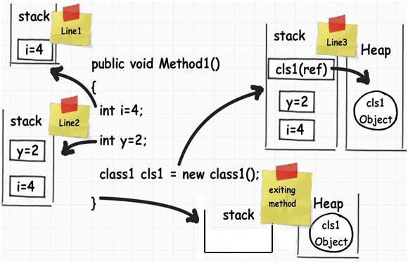



## Stack的三种含义

#### 第一种： 数据结构

特点是LIFO

#### 第二种： 代码运行方式

调用栈（call stack）

表示函数或子程序像堆积木一样存放，以实现层层调用。

	class Student{
	    int age;              
	    String name;      
	
	    public Student(int Age, String Name)
	    {
	        this.age = Age;
	        setName(Name);
	    }
	    public void setName(String Name)
	    {
	        this.name = Name;
	    }
	}
	
	public class Main{
	    public static void main(String[] args) {
	            Student s;           
	            s = new Student(23,"Jonh");
	    }
	}

#### 第三种L内存区域

存放数据的一种内存区域。程序运行的时候，需要内存空间存放数据。一般来说，系统会划分出两种不同的内存空间：一种叫做stack（栈），另一种叫做heap（堆）。

它们的主要区别是：stack是有结构的，每个区块按照一定次序存放，可以明确知道每个区块的大小；heap是没有结构的，数据可以随意存放。因此，stack的寻址速度要快于heap。

一般来说，每个线程分配一个stack，每个进程分配一个heap。也就是说，stack是线程独占的，heap是线程公用的。stack创建的时候，大小是确定的，数据超过这个大小，就发生stack overflow错误，而heap的大小是不确定的，需要的话可以不断增加。

数据存放的规则是：只要是局部的、占用空间确定的数据，一般都存放在stack里面，否则就放在heap里面。

	public void Method1()
	{
	    int i=4;
	
	    int y=2;
	
	    class1 cls1 = new class1();
	}

##### 当Method1方法运行结束

整个stack被清空，i、y和cls1这三个变量消失，因为她们是局部变量，区块一旦运行结束，就没有必要再存在了。而heap之中的那个对象实例继续存在，直到系统的垃圾清理机制将这块内存回收。因此，一般来说，内存泄露都发生在heap，即某些内存空间不再被使用了，却因为种种原因，没有被系统回收。

#### Reference：

http://www.ruanyifeng.com/blog/2013/11/stack.html
